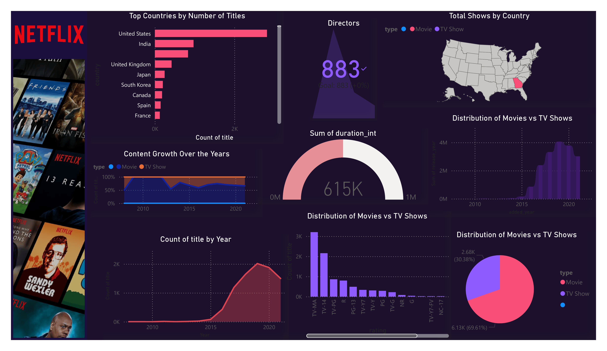

# Netflix Data Analysis – Power BI Dashboard 📊
A visually engaging and interactive Power BI dashboard that analyzes Netflix's content library. It provides insights into trends by year, content type, countries, ratings, and genres using a clean, aesthetic design.

# Overview
This project uses Power BI to explore and visualize trends in Netflix content. The dashboard is designed to help users understand patterns in:

Content type (Movies vs TV Shows)

Year-wise additions

Country of production

Ratings distribution

Genre insights

# Objectives
Create an interactive dashboard using Power BI.

Identify key trends and patterns in Netflix content.

Enable filtering by type, country, release year, and ratings.

Showcase powerful storytelling with data through visualization.

🖼️ Dashboard Preview

